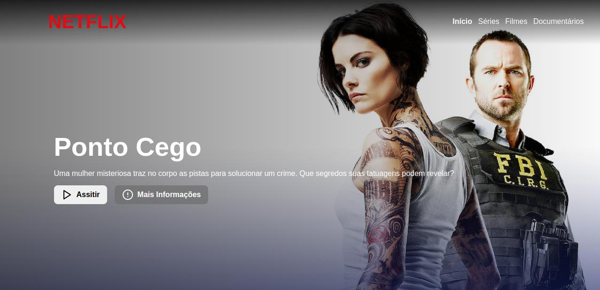
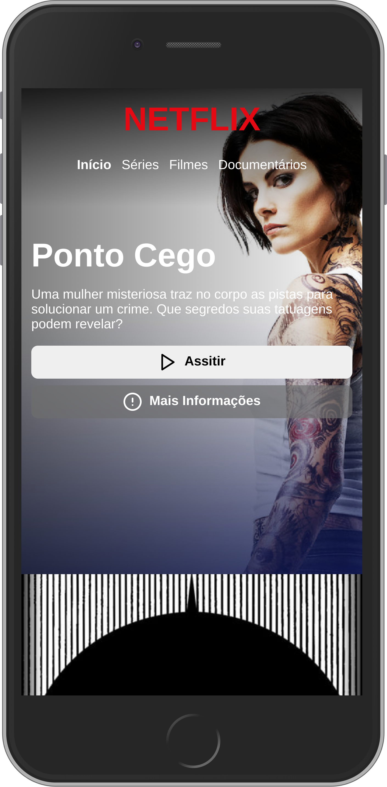

Here is my clone of the Netflix Home Page, which I did for the DIO course.

## How do It Look




## What do Need to Run It?

- Git CLI (Or maybe not)
- A Browser (IE ins't a browser, haha);

## How to Run It?

### Method 1

Open you terminal and insert the following command:

```
  -  git clone https://github.com/hemerson-git/dio-cursos.git
```

Now you just need to open **"index.html"** file with your browser

### Method 2


- Download the Project as A ZIP
- Extract It
- Now, Just open **index.html** file
